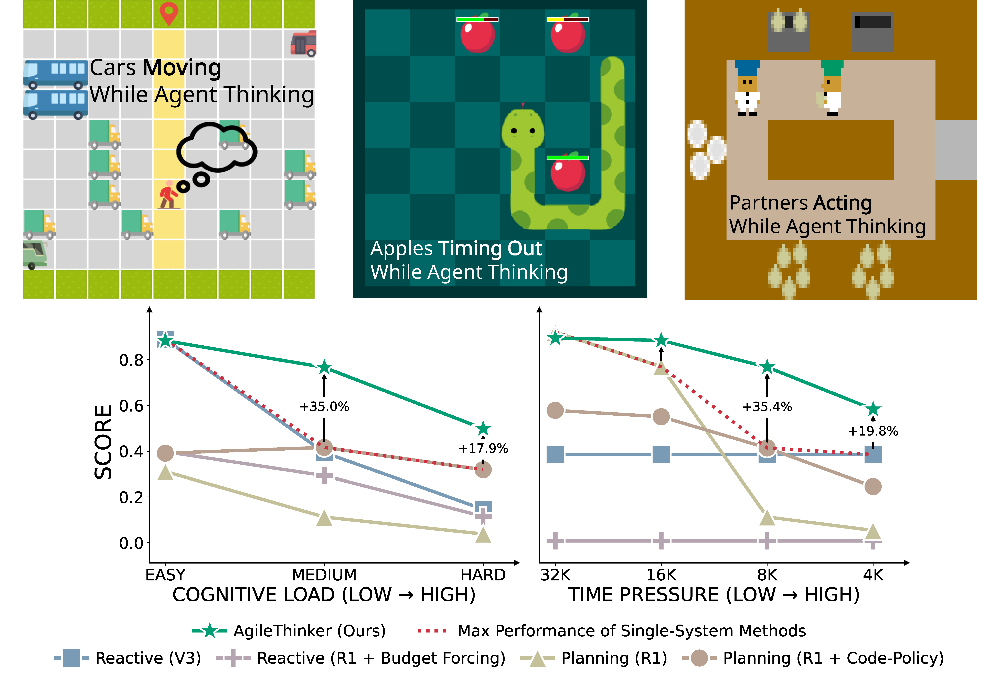

# ⚡🧠🏋️ `realtimegym`

A learning and evaluation environment for language agents reasoning in real-time.

In typical OpenAI Gym environments, you have an agent loop like this:

```python
obs, done = env.reset()

while not done:
    action = agent.act(obs)
    obs, reward, done, info = env.step(action)
```

The time taken in `agent.act(obs)` is unbounded, and language agents could generate very long reasoning,
which takes several seconds or even minutes. This is not suitable for real-time scenarios.

In `realtimegym`, we introduce a suite of real-time tasks and a new interface with explicit time or token budget constraints:

```python
obs, done = env.reset()

while not done:
    agent.observe(obs)
    agent.think(timeout=8192)
    action = agent.act() or "S"
    obs, done, reward, reset = env.step(action)
    total_reward = reward # Pay attention that reward here is not accumulative
```

Both `observe` and `act` are non-blocking fast calls, while `think` is where the agent can take time to reason within the given `timeout` budget.
The stateful design allows agents to maintain internal thinking processes across multiple steps.


## Task Suite

`realtimegym` includes three games with real-time constraints:

| Game | Description | Actions | Difficulty Levels |
|------------|-------------|---------|-------------------|
| **Freeway** | Cross the road avoiding cars | `U` (up), `D` (down), `S` (stay) | v0 (Easy), v1 (Medium), v2 (Hard) |
| **Snake** | Greedy snake game | `U`, `D`, `L` (left), `R` (right), `S` | v0, v1, v2 |
| **Overcooked** | Cooperative cooking | `U`, `D`, `L`, `R`, `I` (interact), `S` | v0, v1, v2 |

To create an task in our provided suite, use the `realtimegym.make()` function:
```python
# Create any environment with difficulty level
env, seed, renderer = realtimegym.make('Snake-v2', seed=0, render=False)
```

## The challenge of Real-Time Reasoning

Real-time reasoning requires agents to not only produce correct actions, but also make the timely decision.
The following figure shows the benchmark results of different LLM-based agents under various time budgets in the
three tasks that we provide.




## The Agent Interface

Every agent must implement three methods:

```python
from realtimegym.agents.base import BaseAgent

class MyAgent(BaseAgent):
    def observe(self, observation: dict):
        """
        Receive observation from environment.

        observation contains:
        - 'state_string': Text description of game state
        - 'game_turn': Current turn number
        - 'description': Detailed state info (varies by game)
        """
        pass

    def think(self, timeout: int | float):
        """
        Process observation and decide action.

        timeout is either:
        - Number of tokens (if time_unit='token')
        - Seconds (if time_unit='seconds')
        """
        pass

    def act(self) -> str | None:
        """
        Return chosen action or None for default.

        Returns action like 'U', 'D', 'L', 'R', 'S', 'I'
        """
        pass
```

## Using LLM-Based Agents

RealtimeGym includes following built-in LLM agents:

| Agent | Description | Use Case | Supported LLM |
|-------|-------------|----------|--------------|
| **ReactiveAgent** | Fast, reactive responses | Bounded Latency | All OpenAI-compatible |
| **PlanningAgent** | Strategic planning | Unbounded Latency | All OpenAI-compatible |
| **AgileThinker** | Hybrid approach | Combination of Above | Models with transparent thinking tokens


You can evaluate these agents and large language models via cli-command `agile_eval`:

```bash
agile_eval --time_unit token \
    --time_pressure 8192 \
    --internal_budget 4096 \
    --game freeway \
    --cognitive_load E \
    --mode agile \
    --reactive-model-config configs/deepseek-v3.2-reactive.yaml \
    --planning-model-config configs/deepseek-v3.2-planning.yaml \
     --seed_num 1 --repeat_times 1 
```

Or more compactly:

```bash
agile_eval --time_unit token \
    --settings freeway_H_8192_agile_4096 \
    --reactive-model-config configs/deepseek-v3.2-reactive.yaml \
    --planning-model-config configs/deepseek-v3.2-planning.yaml \
    --seed_num 1 --repeat_times 1
```

Note you can also customize the prompts of the experiment by setting `--prompt-config` to a yaml file containing prompt generation modules, which should be a python file containing a function called `state_to_description()` that takes in the observation and agent type (`'reactive'`, `'planning'`, or `'agile'`) and returns one/multiple descriptions of the game state for the agent to reason on. See `configs/example-prompts.yaml` and `configs/prompts/*.py` for examples.

## Budget Formats Explained

RealtimeGym supports two ways to constrain agent thinking:

### Token Budget (default)
```python
# Agent can use up to 8192 tokens for thinking
agent.think(timeout=8192)
```
- Best for: LLM-based agents
- Measures: Token count from API

### Physical Time Budget
```python
# Agent has 5 seconds to think
agent.think(timeout=5.0)
```
- Best for: Real-time scenarios
- Measures: Wall-clock seconds

Set via `--time_unit token` or `--time_unit seconds` on command line.


## Examples

Check out the `examples/` directory:

```bash
# Getting started
python examples/basic_usage.py

# Try all environments
python examples/all_environments.py

# Advanced agent patterns
python examples/custom_agent.py

# Compare difficulty levels
python examples/difficulty_levels.py

```

## API Reference

### Environment Methods

```python
# Create environment
env, seed, renderer = realtimegym.make(env_id, seed=0, render=False)

# Reset environment
obs, done = env.reset()
# Returns: (observation dict, done flag)

# Take action
obs, done, reward, reset = env.step(action)
# Returns: (observation dict, done flag, reward, reset_flag)
```

### Observation Structure

```python
{
    'state_string': 'Text representation of game state',
    'game_turn': 42,  # Current turn number
    "state": { ... }  # Game-specific detailed state info in dict
}
```

## Testing

Run the test suite:

```bash
pytest
```

## Development

Make sure to use `uv` and `pre-commit`:

### Pre-commit Hooks

```bash
# Install hooks
uv run pre-commit install
```

### Static Typing

```bash
# Type checking
ty check
```

## Project Structure

```
realtimegym/
├── src/realtimegym/
│   ├── __init__.py          # Main API (make function)
│   ├── agile_eval.py       # Agent evaluation script
│   ├── agents/              # Built-in LLM agents
│   │   ├── base.py
│   │   ├── reactive.py
│   │   ├── planning.py
│   │   └── agile.py
│   └── environments/        # Game environments
│       ├── base.py
│       ├── freeway.py
│       ├── snake.py
│       └── overcooked.py
├── tests/                   # Test suite
├── examples/                # Example scripts
└── pyproject.toml          # Package configuration
```

## Documentation

- **[CONTRIBUTING.md](CONTRIBUTING.md)** - Contribution guidelines
- **[tests/README.md](tests/README.md)** - Detailed test documentation
- **[examples/README.md](examples/README.md)** - Examples guide

## Citation

If you use RealtimeGym in your research, please cite:

```bibtex
@software{realtimegym2025,
  title={RealtimeGym: A Real-time Gym for Evaluating Language Agents},
  author={wenyl},
  year={2025},
  url={https://github.com/wenyl22/RealtimeGym}
}
```

## Links

- **Homepage**: https://github.com/wenyl22/RealtimeGym
- **Documentation**: https://bleaves.github.io/real-time-reasoning/
- **Issues**: https://github.com/wenyl22/RealtimeGym/issues

## License

MIT License - see LICENSE file for details.

---

**Quick Links**: [Installation](#installation) • [Examples](#examples) • [API Reference](#api-reference) • [Testing](#testing) • [Contributing](CONTRIBUTING.md)
